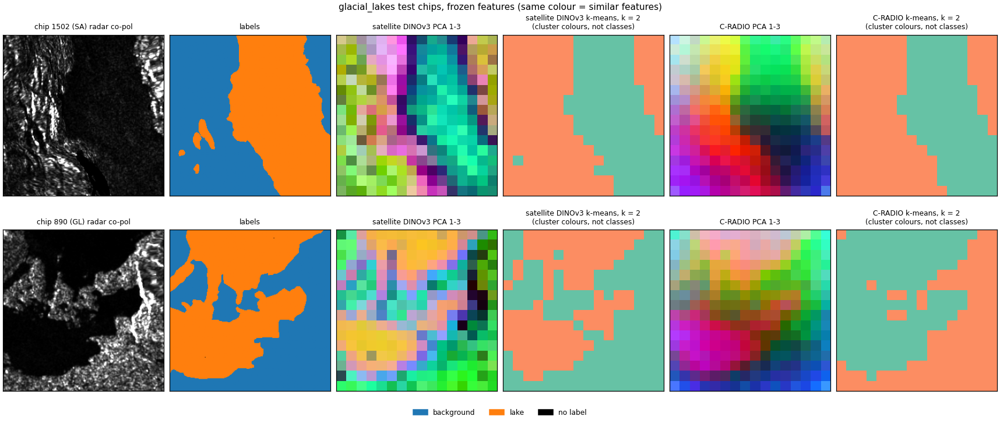
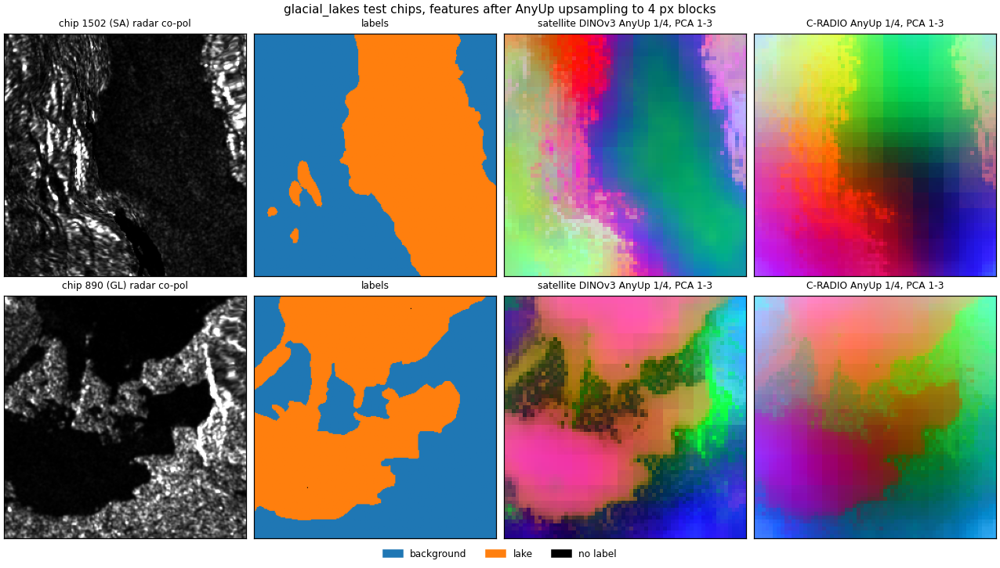
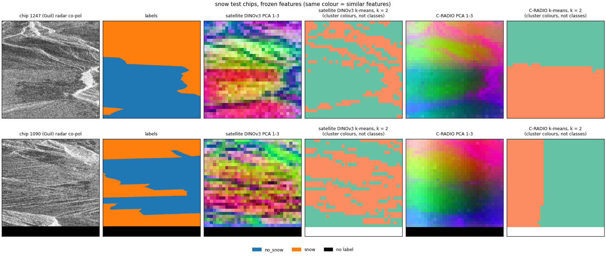
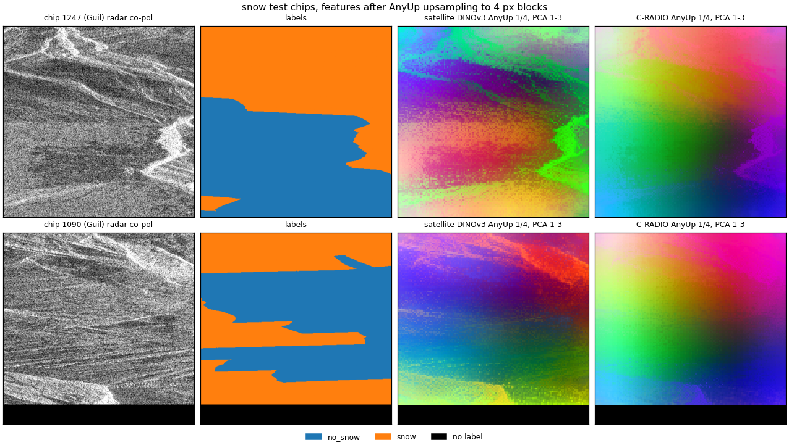
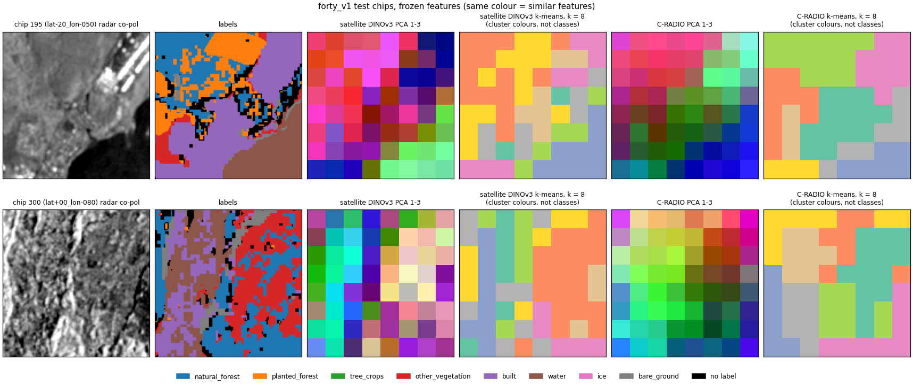
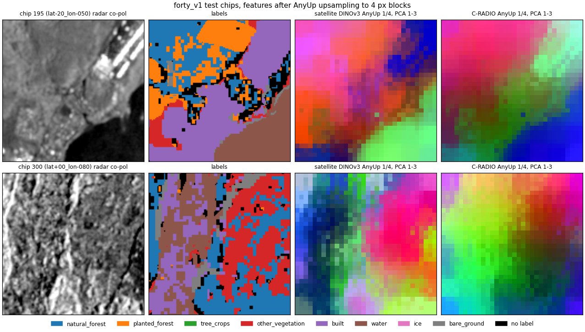
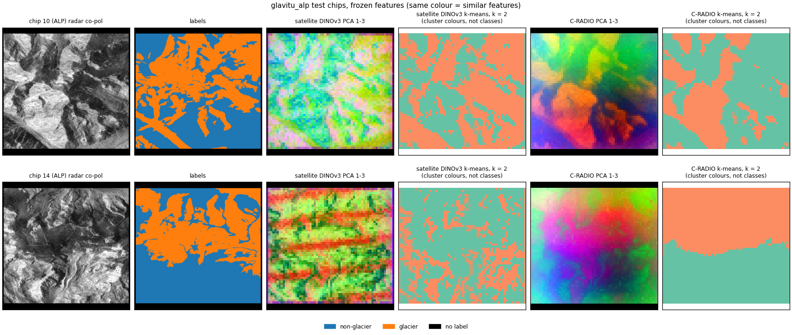
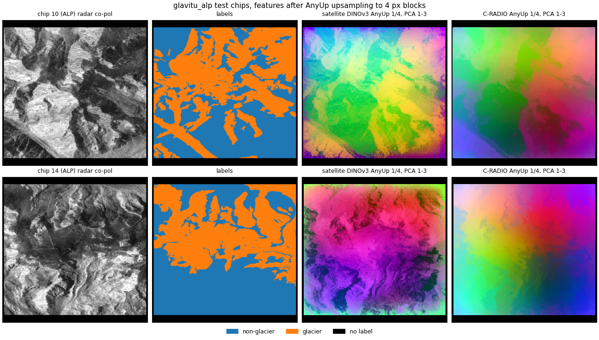

# sar-transfer-domains

**Do frozen image encoders transfer to radar images outside glaciers?**

This is part two of a study. Part one,
[sar-transfer-glaciers](https://github.com/saverin0/sar-transfer-glaciers), tested frozen
encoders on glacier calving fronts in SAR (synthetic aperture radar) images. Part two takes
the same frozen pipeline to four public Sentinel-1 datasets, glacial lakes, snow, forest types
and alpine glaciers. The encoders stay frozen, only small heads are trained, nothing is tuned
per dataset, and the protocol was fixed before any number existed.

**In short**

- With a small decoder, the satellite-pretrained DINOv3 is ahead of C-RADIOv4-H on every
  dataset and every test split, most on snow (snow IoU 0.735 against 0.602). In part one's
  glacier test it was the other way round.
- In the one like-for-like published comparison (snow, same test set, same two radar channels,
  same labels), the frozen satellite DINOv3 reaches a snow F1 of 0.847 against 0.897 for a
  U-Net trained for the task.
- Where the published models also see optical data, the frozen radar-only numbers reach about
  60-80 % of the published scores. Frozen features plus a small head are a cheap baseline, not
  a replacement.
- Looking at the frozen features directly (notebook 03), the satellite DINOv3 keeps the classes
  further apart on every dataset (glacial lakes nearly tied). From one lake patch, 83 % of its 100 most similar patches in
  the test split are lake, against 37 % for C-RADIO.

Full tables, validation numbers, the frozen-feature numbers and all caveats are in
[docs/results.md](docs/results.md).

## Method (fixed before any number)

- Frozen encoders at the layers chosen in part one, DINOv3 ViT-L SAT-493M (layer 21) and
  C-RADIOv4-H (layer 32).
- Input is co-pol, cross-pol and co minus cross, standardised with the training split's
  statistics.
- Two heads, a linear probe on the 16 px patch features and part one's small decoder (3 seeds).
- Official splits. Only "train" is trained on. Every other split is scored in the same run,
  because nothing is chosen on any split.
- Metrics are IoU per class, mIoU and accuracy; for two classes also IoU, F1, precision and
  recall of the target class; per region; and a majority baseline.

## Datasets and settings

| domain | dataset | official source | licence | settings |
|---|---|---|---|---|
| glacial lakes | Glacial-Lake-Bench (GLB) and Glacial-Lake-Challenge (GLC), Kaushik et al. | Zenodo record 17917359, doi 10.5281/zenodo.17917359 | CC BY 4.0 | GLB is downloaded from its Hugging Face copy (Sk-21/Cryo-Bench) and checked file by file against the Zenodo release; 6 extra test pairs in the Hugging Face copy are left out, so the data is exactly Zenodo's; the challenge set comes from Zenodo. Official random split, plus region SEE (South Asia East) held out as `test_region_SEE`; the challenge set as `test_challenge`. |
| snow | Replication data of Briand et al. (called SnowSAR here) | Recherche Data Gouv, doi 10.57745/IMTSFL | Etalab Open Licence 2.0 | Five official splits (train, val, test, test_spatial, test_temporal); MODIS labels without interpolation; 512 px chips. |
| forest | ForTy v1, Google DeepMind (Jiang and Neumann) | `gs://forest_typology/forty_v1/1.0.0` | CC BY-SA 4.0 | Worldwide, the first 32 train, 32 validation and 32 test shards (not the full 1.1 TB); descending orbit; 128 px chips. Europe holds 10.8 % of the converted chips. |
| alpine glaciers | GlaViTU tile dataset, Maslov et al. | NIRD, doi 10.11582/2024.00168 | CC BY 4.0 | Alps tiles only; official split; per tile the orbit with more valid pixels; 992 px chips. |

Known limits. The official glacial-lake test split shares Sentinel-2 scenes with training
(hence the SEE hold-out). The ForTy class codes are inferred (no public source gives the
integers) and are checked at run time. The snow label files differ from the dataset's README
(float32 with 2 bands, not 1-band uint8); band 1 holds the documented codes and is used. Each
dataset keeps its own licence; no data is redistributed here.

## The four datasets

Each picture shows two test chips, picked by a fixed rule from the labels only (notebook 03).
From the left, the radar co-pol image, the labels, then for each encoder its frozen features, one
per 16 px patch, as colours (the first three principal components as RGB, same colour = similar
features) and as k-means clusters (as many clusters as classes; cluster colours are not classes).
The second picture shows the same chips with the features after AnyUp upsampling to 4 px blocks
(1/4 of the image resolution), as PCA colours only. The other views are in notebook 03.

### Glacial lakes

Glacial-Lake-Bench chips of 256 px from every glacier region except Antarctica. The radar is the
Sentinel-1 VV and VH bands (HH and HV in Arctic regions) of the dataset's 11-band chips, as a
per-chip 0-1 stretch. The lake masks come from a 2020 Sentinel-2 inventory (Zhang et al. 2024), so
they are independent of the radar. 14,820 training chips; scored on the official test split
(1,834 chips), the challenge set (1,105) and the held-out region SEE (613).





### Snow

SnowSAR, Sentinel-1 VV and VH in radar geometry over two basins of the French Alps, in 512 px
chips. The labels are same-day MODIS snow cover (NDSI above 0.4, 500 m cells) without
interpolation, so cloud gaps stay unlabelled (28-37 % of the pixels). Training, validation and
test are the Guil basin in the 2018-19 season; two more test splits are the Gyronde basin (other
basin) and Guil in 2019-20 (next winter). 3,618 training chips.





### Forest

ForTy v1, worldwide plots of 128 px at 10 m. The radar is Sentinel-1 from the descending orbit,
the mean of the dataset's 2020 seasonal mosaics. Eight classes (natural forest, planted forest,
tree crops, other vegetation, built-up, water, ice, bare ground), harmonised by the dataset's
authors from public maps; the non-forest classes come from WorldCover, which partly uses
Sentinel-1. The first 32 train, validation and test shards give 5,052, 618 and 636 chips. A
128 px chip is only 8 x 8 patches for the encoders, which is why the feature maps look coarse.





### Alpine glaciers

The Alps tiles of the GlaViTU dataset, Sentinel-1 co-pol and cross-pol at 10 m in dB, one 992 px
chip per tile (the black border is padding and is ignored). The glacier outlines come from a
Sentinel-2 inventory (Paul et al. 2020), and debris-covered ice counts as glacier. 177 training,
59 validation and 60 test tiles.





## Results

Run on 2026-09-29 on a Colab A100 (80 GB) with High-RAM. For glacial lakes, alpine glaciers
and snow the number is the IoU of the target class (lake, glacier, snow), for forest the mIoU
over its 8 classes. Decoder values are the mean ± SD of 3 seeds. The majority baseline predicts
the most frequent training class everywhere, so its target-class IoU is 0 (its mIoU is
0.48-0.49 for lakes, 0.47 for alpine glaciers, 0.18-0.21 for snow and 0.04 for forest).

| dataset, split | satellite DINOv3, probe | satellite DINOv3, decoder | C-RADIO, probe | C-RADIO, decoder |
|---|---|---|---|---|
| glacial lakes, test | 0.254 | 0.279 ± 0.004 | 0.259 | 0.260 ± 0.001 |
| glacial lakes, challenge set | 0.304 | 0.299 ± 0.004 | 0.301 | 0.285 ± 0.002 |
| glacial lakes, held-out region SEE | 0.220 | 0.208 ± 0.002 | 0.196 | 0.179 ± 0.006 |
| alpine glaciers, test | 0.355 | 0.543 ± 0.004 | 0.355 | 0.507 ± 0.006 |
| snow, test (Guil, 2018-19) | 0.640 | 0.735 ± 0.007 | 0.622 | 0.602 ± 0.004 |
| snow, other basin (Gyronde) | 0.618 | 0.678 ± 0.010 | 0.601 | 0.510 ± 0.017 |
| snow, next winter (Guil, 2019-20) | 0.673 | 0.770 ± 0.011 | 0.644 | 0.591 ± 0.014 |
| forest, test (mIoU of 8 classes) | 0.402 | 0.384 ± 0.009 | 0.391 | 0.350 ± 0.008 |

- With the decoder, the satellite DINOv3 is ahead of C-RADIO on every dataset and split, most
  on snow (0.735 against 0.602 on test). In part one's glacier test it was the other way round.
- The two linear probes are close everywhere (within 0.03).
- The decoder adds most on alpine glaciers (+0.19 satellite DINOv3, +0.15 C-RADIO) and on snow
  for the satellite DINOv3 (+0.10 on test). On lakes it changes little (-0.02 to +0.03), and on
  forest it loses 0.02-0.04, whose 128 px chips give the encoders only an 8 x 8 grid. C-RADIO's
  decoder stays below its own probe on snow.
- Validation tracks test within 0.025, except the satellite DINOv3 decoder on snow (0.689
  validation, 0.735 test).

**Caveats**

- Published results come from trained models and, except for snow, also use optical data (see
  below), so only the snow row compares like for like.
- Glacial-lake values are the dataset's per-chip 0-1 stretch, not dB, so the third input
  channel is not a log ratio there.
- Snow labels are MODIS snow cover in 500 m blocks, and 28-37 % of the chip pixels have no
  label (cloud gaps and missing radar). The snow radar values are uncalibrated dB (all
  positive), which the per-channel standardisation handles.
- One alpine test chip (tile ALP-31-33) has 10 pixels above 20 dB (up to 170 dB, far outside
  the training range of at most 14.5 dB). They are kept as converted.

Run time for all four datasets and both encoders was about 1 h 35 min (per encoder forest
3-4 min, lakes 5, snow 15-16, alpine glaciers 23, the last because its 992 px chips make the
decoder slow).

### Published results on these datasets

Only the snow paper reports a result from the two radar channels alone, so the other rows are
context, not a ranking. Every published number below comes from a model trained for the task, and
all but the snow row also use optical data. Ours are frozen encoders on the two radar channels alone.

| dataset, split | published | their input and training | comparable to ours? | ours, best |
|---|---|---|---|---|
| glacial lakes, test | mIoU 0.85 Prithvi-EO-2.0, 0.82 U-Net and DOFA, 0.80 DeepLabv3+ | optical, SAR and DEM (11 channels; Prithvi 6), fully fine-tuned | same split; their mIoU includes background, so we compare our mIoU | mIoU 0.595 (satellite DINOv3 decoder) |
| glacial lakes, challenge set | mIoU 0.79 Prithvi and DOFA, 0.76 U-Net | as above | same set, same mIoU | mIoU 0.614 (satellite DINOv3 probe) |
| alpine glaciers, test | glacier IoU 0.844 GlaViTU, 0.835 DeepLabv3+, 0.873 GlaViTU with Sentinel-1 backscatter and coherence added | optical and DEM (plus InSAR in the 0.873 run), trained | same split, same metric | glacier IoU 0.543 (satellite DINOv3 decoder) |
| forest | macro F1 81.1 MTSViT, 79.6 TSViT, 49.4 UTAE, 32.4 UNet3D | seasonal Sentinel-2, climate and elevation, full test set | no (other metric, far larger test set) | mIoU 0.402 (satellite DINOv3 probe) |
| snow, test (Guil, 2018-19) | snow F1 0.897 (U-Net with EfficientNet-B0, VV and VH only, 6 seeds); 0.921 with a snow-free reference image added | trained U-Net, same two radar channels, same non-interpolated labels, threshold tuned on validation | same test set, pooled counts; F1 not IoU, so ours converted (F1 = 2 IoU / (1 + IoU), exact from the same counts) | snow F1 0.847 (satellite DINOv3 decoder, IoU 0.735) |

In the one like-for-like comparison (snow), the frozen satellite DINOv3 with a small decoder
reaches a snow F1 of 0.847 against 0.897 for a trained U-Net. Where split and metric match but
the published models also see optical data, the frozen radar-only numbers reach about 60-80 %
(alpine glaciers 0.54 against 0.84-0.87, glacial lakes 0.60 against 0.80-0.85 on test and 0.61
against 0.76-0.79 on the challenge set). This is in line
with part one, where frozen features and a small head were a cheap baseline, not a replacement.
Cryo-Bench's code repository (not its paper) also lists frozen-encoder results on the same
glacial-lake split with 11 input channels, mIoU 0.69-0.80; no SAR-only run there.

The sources are listed under Citations; the full numbers are in [docs/results.md](docs/results.md).

## What the frozen features look like (notebook 03)

Descriptive, after the run, trains nothing. For each dataset and encoder, on the test split and
with the run's own input, notebook 03 shows the patch features as colours (PCA) and clusters
(k-means) on two chips, a similarity search from one query patch, and how far each class sits
from the others (a ranking AUC over the test patches, 1 = fully apart). The same views are
repeated after AnyUp upsampling to 4 px blocks. The chips and the query are picked by fixed
rules from the labels only.

| mean class AUC | satellite DINOv3 | satellite DINOv3, AnyUp | C-RADIO | C-RADIO, AnyUp |
|---|---|---|---|---|
| forest | 0.888 | 0.870 | 0.867 | 0.849 |
| glacial lakes | 0.911 | 0.886 | 0.909 | 0.890 |
| alpine glaciers | 0.795 | 0.754 | 0.757 | 0.711 |
| snow | 0.691 | 0.738 | 0.624 | 0.628 |

With the raw features, the satellite DINOv3 keeps the classes further apart on every dataset,
which matches the decoder results; on glacial lakes it is nearly a tie (0.911 against 0.909), and
after AnyUp C-RADIO is slightly ahead there (0.890 against 0.886). The satellite DINOv3's
similarity search is much purer too, from one lake patch 83 % of the 100 most similar test
patches are lake (97 % of the 1,600 most similar AnyUp blocks), against 37 % (44 %) for C-RADIO.


From one lake patch (yellow), how similar every patch of the chip is to it for each encoder
(darker = more similar). Below each map, the classes of the 100 most similar patches in the whole
test split.

AnyUp lowers the class AUCs a little except on snow, but its 4 px blocks
include many cells right at class borders that the 16 px patches never counted, so these are a
harder set of cells, not a clean loss. The centres come from the test split's own labels, so
the AUCs describe the features; they are not scores of a model.

## How to run

Code reaches Colab through the sync cell in each notebook, never by cloning.

1. On your computer, in this folder, `python sync.py` packs `src/` into the notebooks
   (`python sync.py --check` says whether they are up to date).
2. `notebooks/01_prepare.ipynb`, CPU runtime with High-RAM, downloads each dataset from its
   official source, converts it once and copies it to Drive `MyDrive/sar-transfer-part2/domains/`.
   Its last cell (cell 8) can upload the converted files to private Hugging Face repos (it needs a write
   token, and the account name in the cell).
3. `notebooks/02_run.ipynb`, A100 with High-RAM, runs both encoders on every converted dataset.
   It takes the private Hugging Face copy of the converted data (the account is set in cell 3)
   when it is the same conversion as the one on Drive and HF_TOKEN can read it, else the Drive
   copy; only complete copies are used. Results go to `MyDrive/sar-transfer-part2/results/`; a
   finished run is skipped only when its settings and data match.
4. `notebooks/03_embeddings.ipynb`, A100 with High-RAM, after 02 (it reuses 02's channel
   statistics), writes the frozen-feature views, raw and after AnyUp, to
   `MyDrive/sar-transfer-part2/embeddings/`.

Secrets live in a `.env` on Drive at `MyDrive/sar-transfer/.env` (see `.env.example`), the same
file as part one; model weights are cached in `MyDrive/sar-transfer/hf_cache`.

Offline tests run on small synthetic files, one script per test, for example
`python tests/test_contract.py`. Set TMPDIR, TEMP and TMP to choose where their temporary files
go (see `tests/_setup.py`). `tests/test_alpine.py` needs h5py.

## Security and provenance

- The models only run inference, and every `torch.load` in `src/` uses `weights_only=True`.
- C-RADIO's remote code is pinned to revision `0057b339059c0b9e1b4ba996f975410ebbfdfcc8`, and
  its Python files are SHA-256-checked against a reviewed copy before loading.
- AnyUp's inference code is vendored. Its weights come from the authors' GitHub release if
  missing and are checked by size and full SHA-256.
- DINOv3 is loaded from the commit every run here used (`f692fa42da72c6797b67cd73494a168d1120d3ee`).
- The converters check the checksums the sources publish, except for the alpine Alps subset, which
  is copied in byte ranges from whole files and checked by byte counts only. The glacial-lake
  Hugging Face copy is compared file by file with the Zenodo release, and its archive is
  extracted only after every member path is checked.
- Packages installed at run time are pinned to exact versions. The pins were set after the run,
  to the then current releases; the run did not record the versions it installed. Every new run
  stores its package versions in its `info.json`.
- The GPU notebooks load only the read token. The write token is read by notebook 01's upload
  cell alone and never put into the environment.
- `sync.py` packs only files git tracks, and stops on untracked or git-ignored files and on
  anything that looks like a token or a key, so nothing kept out of git can reach a notebook.

The notebook outputs are from the runs reported here. The code was tidied afterwards (the fixes
above, part one's unused modules removed, a data staging helper), which does not change the
results. One difference remains. For the 992 px alpine chips the encoder now runs 8 (DINOv3)
or 4 (C-RADIO) chips per batch instead of 32 and 16, to save GPU memory, so a rerun of that
dataset can differ in the last digits.

## Licences

| component | licence | use here |
|---|---|---|
| this repository | MIT, see `LICENSE` (Copyright (c) 2026 Abhishek Singh) | everything except `src/sartransfer/models/anyup/` |
| `src/sartransfer/models/anyup/` | CC BY 4.0, third-party code (LICENSE and NOTICE.md in the folder) | vendored AnyUp inference code |
| Glacial-Lake-Bench and Glacial-Lake-Challenge | CC BY 4.0 | downloaded at run time |
| SnowSAR replication data | Etalab Open Licence 2.0 | downloaded at run time |
| ForTy v1 | CC BY-SA 4.0 | downloaded at run time |
| GlaViTU tile dataset | CC BY 4.0 | downloaded at run time |
| DINOv3 ViT-L/16 SAT-493M | DINOv3 License (Meta), gated with manual approval | downloaded at run time; publications must acknowledge the use of DINOv3 |
| C-RADIOv4-H weights and remote code | NVIDIA Open Model License Agreement; the remote code files carry NVIDIA notices | downloaded at run time; only SHA-256 values are stored here |

No weights or data are redistributed here. This work uses DINOv3 by Meta.

## Citations

- Kaushik et al. Glacial-Lake-Bench, Earth System Science Data Discussions (preprint), 2026,
  doi 10.5194/essd-2026-474. Data on Zenodo, doi 10.5281/zenodo.17917359.
- Kaushik et al. Cryo-Bench, arXiv 2603.01576, 2026.
- Briand, S., Weissgerber, F., Lobry, S., and Idier, J. Weakly supervised learning for snow cover
  segmentation in mountainous areas from Sentinel-1 SAR images using interpolated NDSI time
  series, ISPRS Journal of Photogrammetry and Remote Sensing 239, 670-688, 2026,
  doi 10.1016/j.isprsjprs.2026.05.013. Data, Recherche Data Gouv, doi 10.57745/IMTSFL.
- Jiang and Neumann. ForTy (Not every tree is a forest), IGARSS 2025, arXiv 2505.01805.
- Maslov, Persello, Schellenberger and Stein. Globally scalable glacier mapping by deep learning
  matches expert delineation accuracy, Nature Communications, 2025, arXiv 2401.15113. Data,
  NIRD, doi 10.11582/2024.00168.
- Siméoni, O., et al. DINOv3, arXiv 2508.10104, 2025.
- Ranzinger, M., Heinrich, G., McCarthy, C., Kautz, J., Tao, A., Catanzaro, B., and Molchanov,
  P. C-RADIOv4 (Tech Report), arXiv 2601.17237, 2026.
- Wimmer, T., Truong, P., Rakotosaona, M.-J., Oechsle, M., Tombari, F., Schiele, B., and
  Lenssen, J. E. AnyUp, Universal Feature Upsampling, ICLR 2026, arXiv 2510.12764.

## Repository layout

```
LICENSE                    MIT
.env.example               template for the Hugging Face tokens
pyproject.toml             package metadata and dependencies
sync.py                    packs src/ into every notebook (--check, --clear)
docs/results.md            full tables, method details and caveats
docs/figures/              pictures from notebook 03 used in this README
notebooks/                 01_prepare (CPU), 02_run (GPU), 03_embeddings (GPU)
tests/                     offline tests on synthetic files
src/sartransfer/domains/   prepared format, s1input, converters (glacial_lakes, snow, forest, alpine),
                           run, embed_views, hub
src/sartransfer/           encoders, probe, decoder and the vendored AnyUp (from part one),
                           env (secrets), sync (the sync cell)
```

All code outside `src/sartransfer/models/anyup/` was written for this project, with the help of
an AI coding assistant (Claude Code).
